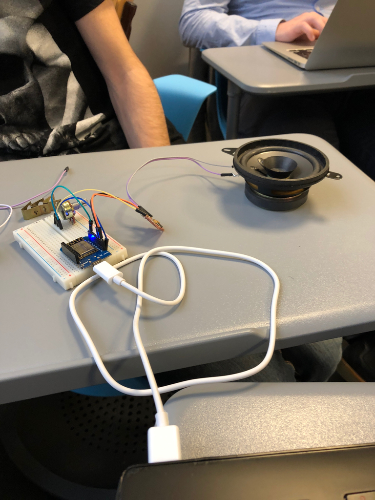

# Word Box

## Description

The word box allows you to **record words and to play it again and again when moving the box from downside to upside** (like a ["Moo box"](https://en.wikipedia.org/wiki/Moo_box)).


## Components

The project is composed by multiple components :

* **1 Arduino card** ESP8266 hosting a WiFi network with a web server
* **1 accelerometer** MPU6050 to detect movements
* **1 amplifier** PAM8403
* **1 speaker** Dual Cone to broadcast the sound

## Setup environment


### Clone project
```sh
https://github.com/RossignolVincent/ESGIWordBox.git
```

If you don't have arduino
  1. download it here: https://www.arduino.cc/en/main/software
  2. If you use windows/OSx you will probably need drivers: https://www.wemos.cc/downloads

Start Arduino IDE

### Setup the board

1. Open the Preferences window
2. In the Additional Board Manager URLs field, enter this URL : http://arduino.esp8266.com/versions/2.3.0/package_esp8266com_index.json
3. Open `Tools` -> `Board` -> `Boards Manager...`
4. Type `esp` and the `esp8266` platform will appear, install it
5. Select your board: `Tools` -> `Board` -> `Wemos D1 R2 & mini`


### Add external libraries

The project uses the following libraries :

* **spiffs** for the file system
* **mpu6050_tockn** to manage the accelerometer
* **wire** to manage the connections between all the components
* **esp8266** for the Arduino card

## What we tried and what issues we faced

* **Mozzi** : We had difficulties to work with the Mozzi library and the ESP8266. We need more time to investigate this solution. Moreover, Mozzi isn't working well with WiFi.
* **Audio file format** : Mozilla is exporting audio files in .ogg and our library is reading .mp3 files. We need to find an ogg-mp3 converter.
* **Browser** : Chrome is blocking the microphone access if the website is not in HTTPS.
* **ESP8266Audio** : The library is working well only with some specific MP3 caracteristics. Otherwise, it works but the sound quality isn't good.

## How does it work ?

At the start, the Arduino card **create a WiFi network** :

* SSID : TwoMenOnePled 
* Password : Azerty1234

You will have to **connect to this WiFi network** and to **go to the following address** : 192.169.4.1

On the web server, **you can record a sound**. This sound will **be played at each box movement**.



